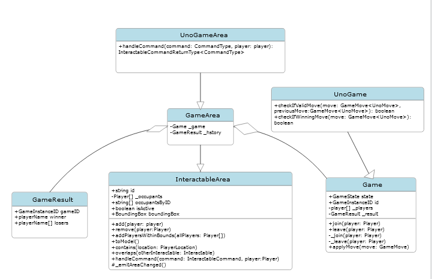

# Covey.Town

Covey.Town provides a virtual meeting space where different groups of people can have simultaneous video calls, allowing participants to drift between different conversations, just like in real life.
Covey.Town was built for Northeastern's [Spring 2021 software engineering course](https://neu-se.github.io/CS4530-CS5500-Spring-2021/), and is designed to be reused across semesters.
You can view our reference deployment of the app at [app.covey.town](https://app.covey.town/), and our project showcase ([Fall 2022](https://neu-se.github.io/CS4530-Fall-2022/assignments/project-showcase), [Spring 2022](https://neu-se.github.io/CS4530-Spring-2022/assignments/project-showcase), [Spring 2021](https://neu-se.github.io/CS4530-CS5500-Spring-2021/project-showcase)) highlight select student projects.

The figure above depicts the high-level architecture of Covey.Town.
The frontend client (in the `frontend` directory of this repository) uses the [PhaserJS Game Library](https://phaser.io) to create a 2D game interface, using tilemaps and sprites.
The frontend implements video chat using the [Twilio Programmable Video](https://www.twilio.com/docs/video) API, and that aspect of the interface relies heavily on [Twilio's React Starter App](https://github.com/twilio/twilio-video-app-react). Twilio's React Starter App is packaged and reused under the Apache License, 2.0.

A backend service (in the `townService` directory) implements the application logic: tracking which "towns" are available to be joined, and the state of each of those towns.

## Running this app locally

Running the application locally entails running both the backend service and a frontend.

### Setting up the backend

To run the backend, you will need a Twilio account. Twilio provides new accounts with $15 of credit, which is more than enough to get started.
To create an account and configure your local environment:

1. Go to [Twilio](https://www.twilio.com/) and create an account. You do not need to provide a credit card to create a trial account.
2. Create an API key and secret (select "API Keys" on the left under "Settings")
3. Create a `.env` file in the `townService` directory, setting the values as follows:

| Config Value            | Description                               |
| ----------------------- | ----------------------------------------- |
| `TWILIO_ACCOUNT_SID`    | Visible on your twilio account dashboard. |
| `TWILIO_API_KEY_SID`    | The SID of the new API key you created.   |
| `TWILIO_API_KEY_SECRET` | The secret for the API key you created.   |
| `TWILIO_API_AUTH_TOKEN` | Visible on your twilio account dashboard. |

### Starting the backend

Once your backend is configured, you can start it by running `npm start` in the `townService` directory (the first time you run it, you will also need to run `npm install`).
The backend will automatically restart if you change any of the files in the `townService/src` directory.

### Configuring the frontend

Create a `.env` file in the `frontend` directory, with the line: `NEXT_PUBLIC_TOWNS_SERVICE_URL=http://localhost:8081` (if you deploy the towns service to another location, put that location here instead)

### Running the frontend

In the `frontend` directory, run `npm start` (again, you'll need to run `npm install` the very first time). After several moments (or minutes, depending on the speed of your machine), a browser will open with the frontend running locally.
The frontend will automatically re-compile and reload in your browser if you change any files in the `frontend/src` directory.

# Uno Area

The Uno Area feature in this version of covey town provides an area for players within Covey Town to play a card game called Uno with 1-5 other players.

## Uno Game

Uno is a fun, interactive card game that is great for all ages. In the game you play a card that matches either the color or the value of the most recent card played, and has some special features for certain cards. See https://en.wikipedia.org/wiki/Uno_(card_game) for more specific rules and information.

### Playing the Game

When logging into this version of Covey.town, an "Uno Area" will be outlined on the map. By default, users spawn into the Uno Area. To enter the area, press spacebar, as it is an interactable area, just like others in the game. You will join a waiting room, and will have an option join the game with a button at the top. If there is already a game in progress, you will have to wait for the game to be over to join. Be quick! After you are in the game, press "Ready Up". The button will turn green and mark you as ready, press again to mark yourself as not ready. When enough players are in the game(2), a deal cards button will appear. In order for the deal cards button to work all players in the game must be ready.

7 cards will be dealt to each player. There will be a turn indicator at the top to let you know who's turn it is. If it is your turn, play any card by clicking on it! If you play a wild card, you will be promted to choose the color for the next player to play. Once you have no cards left you are the winner! Everybody else loses. Press join game again to join another game.

To leave the game, press the x in the upper right corner.

Please note that if you leave the game, you will not be allowed back in.

At any point in the game a dropdown menu of all the users in the game will be available for you to see.

Have fun!
